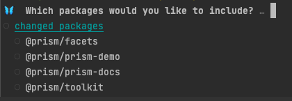
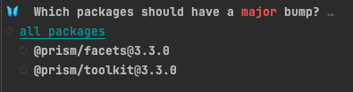
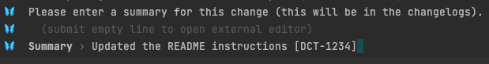
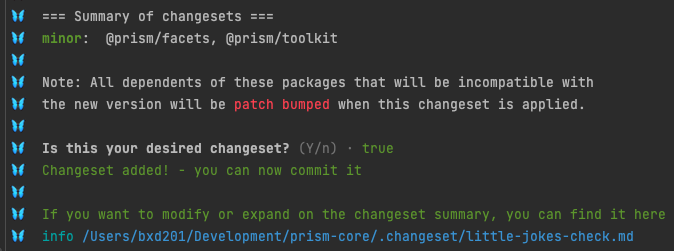

# PRISM Contribution Guide (WIP)

- [Git Process](#git-process)
- [Changeset](#changeset)
  - [Creating a Changeset](#creating-a-changeset)
- [Testing](#testing)
- [Icons](#icons)


## Git Process

WIP

## Changeset

A changeset is required per JIRA ticket at a minimum. When wrapping up the ticket, that is when a changeset is created
and should be part of the final pull request.

#### Creating a Changeset

1. Run `yarn changeset`
2. Pick the packages that you updated as part of your changes.<br />
3. Select the packages that should have a major, minor, or patch version. Pressing `enter` will proceed to the next version type.<br />
4. Add your summary of your changes, add the JIRA number to the end of the summary (ex: [DCT-1234]).<br />
5. After the above steps, you'll see that a new file is created within the `.changeset` directory, commit this file and it will be appended to the `CHANGELOG.md` upon release.
   If you had any mistakes in the above steps, you're able to correct them manually in this file before you commit.<br />

## Testing

WIP

## Icons

We use [FontAwesome Icons Pro](https://fontawesome.com/icons) across PRISM packages. Within facets (currently) all new icons needs to be added to the library in order to be 
used. Within Toolkit, we're able to leverage dynamic imports. 

To use FontAwesome Icons in Toolkit, we are leveraging dynamic imports. Example of dynamic imports below.

**Note: Not all components have been migrated to use dynamic imports yet, all new development should be using dynamic imports.**  

```javascript
import { FontAwesomeIcon } from '@fortawesome/react-fontawesome'
import { solid, regular, brands } from '@fortawesome/fontawesome-svg-core/import.macro' // <-- import styles to be used

<FontAwesomeIcon icon={solid('user-secret') />
<FontAwesomeIcon icon={regular('coffee')} />
<FontAwesomeIcon icon={brands('twitter')} />
```
